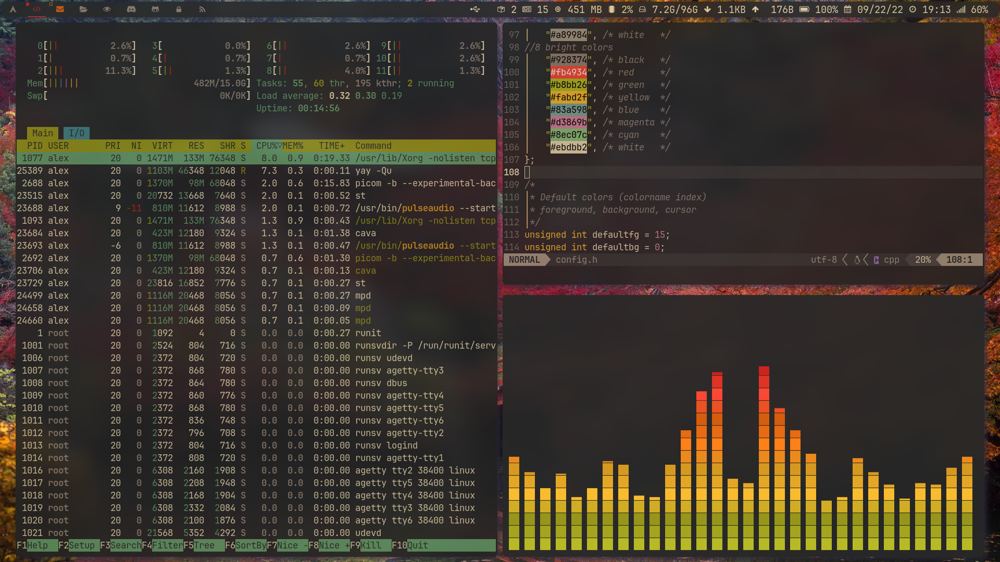

# MyDotfiles
Simple configurations I use on my daily driver

### Update:

#### Update 2:

## What even is this?

All my suckless programs have luke smith's builds as their base, but the source code has been altered quite a bit, since I removed some patches and added a few, I made several additions to the source with bits from Mental Outlaw's build which really saved me a few times. Another person I must thank is siduck because his build of dwm (github.com/siduck/chadwm) gave me lots of ideas like the colorfultag patch and the bar/statuspadding patches which really helped my dwm take off. Other than dwm, st, dmenu and dwmblocks are pretty much just how I got them with a couple of things changed or added to them, like the colors/modules and a little variable I defined for dwmblocks so I don't have to flood /usr/local/bin/ with scripts. I tried to keep dwm minimal, stylish and useful, without having 70 patches on it. Things like sticky/scratchy or whatever you call them patches have been removed, just like xresources/clickable statusbar and anything that has to do with dwmblocks/hide vacant tags etc.

## Patches applied

I applied the following patches to dwm:

- statuspadding, determines the padding between the edge and the content for the statusbar
- barpadding, makes the statusbar float
- colorfultag patch (https://github.com/fitrh/dwm/issues/1 and siduck's chadwm), *This, like most patches can be easily removed and of course you can tweak everything about this around*
- preserveonrestart patch, just so you can refresh dwm without all windows spawning on tag1
- swallow patch, whenever you open a gui program from the terminal, it swallows it, meaning that the terminal disappears and when you close that program it appears again, very useful for using nsxiv etc.
- Column patch, can't really find this one again but it makes the master and slave windows the same size
- True Fullscreen, alt-F makes the window as big as the whole screen
- shiftview, not really a patch but alt-g does the trick
- vanity gaps, gaps, consistent through different layouts
- Layouts (needs some work)
- notitle, windows have no title on the bar, *also easily removable*
- underline tags, tags in use have a little bar beneath them, looks good
- status2d, allows for a colored bar, the tags, as well as slsatus use it

St/Dmenu and Dwmblocks have the patches they came with -xresources

*All Of these programs have colored emoji support, you simply have to install an adequate font and tell them to use it.*

### Requirements

- imlib2  for nsxiv
- Xinerama for suckless
- any font patched with nerd font symbols, only reason I use a nerd font is for the arch logo and the cooler retro cpu character. You can get away with font-awesome
- xsetroot
- acpi

## Other configurations

- zshrc with zsh plugins and zprofile
- my startup script
- all I care about from the /etc/default/grub like the kernel params, which make booting up a little quicker and much quieter
- some wallpapers I found while ricing at r/unixporn that just look amazing, perhaps not the best quality but you can search for the original images
- a couple dozen scripts, both for dwmblocks and other useful ones. Most come from Luke Smith but I have written and edited a few
- My config for firefox (simply Arkenfox with a user-override.js from [here](https://www.youtube.com/watch?v=GVOcElOPs8E))
- Cava, with gruvbox colors
- Slstatus, the suckless status monitor, looks stlish and doesn't take 4 seconds to load, if you want to add colors to some unicode character and then change the colors for the information, it is a huge pain (can only really have like 4 functions on), but for something nice and simple it works very well. 
- dunst, no other dunstrc worked as well so yeah, good enough
- iptables, which is still under work and not even sure if I will use it
- lf, Luke Smith's config with lfimg scripts etc. (cirala/lfimg)
- mpd, uncomment and comment alsa or pulse, also has the visualizer
- mpv, simple enough, it doesn't lag and plays nicely + resumes any videos
- ncmpcpp, nothing crazy, just luke smith's with vim bindings
- newsboat
- nsxiv, control+x and then control-d deletes the current image, or well, moves it to ~/.trash
- nvim, gruvbox colors, nice indenting, completion, lualine, web-devicons and colorizer. I wish to convert to init.lua but for now this config does everything I want it to
- picom, animations/blurred/transparent/rounded corners, dim-inactive, opacity-inactive and active. It looks nice and feels even better. you should use a picom fork that offers animations, like [picom-animations-git yay](https://aur.archlinux.org/packages/picom-animations-git)
- zathura, just a dark background and the basic bindings.

## Current Issues

- Layouts are messed up

## Usage

Simply compile these programs or put the config files in the .config directory.
I have tried compiling the suckless programs with the -03 flag but the resource usage was too high for the performance boost which was barely noticeable.
To run dwm simply use my .xinitrc script or append "exec dwm" to yours after compiling it.

## Possible Improvements

- [x] Make as many appplications transparent and/or blurry, including the terminal. Not sure how feasible this is with the simple terminal but it could improve this setup
- [x] Rounded corners on all windows, pretty sure this build has it if you disable the border px to 0 and run a compositor like picom
- [x] Give dwmblocks and the bar some color, ~~ I have tried to do so and it just doesn't work, my tags are already colorful so I just don't know what's going on, you could try something like luastatus or slstatus but I barely know how to echo my name on these languages and the community doesn't seem to be so eager to create different modules. Furthermore, tweaking these modules to display the way you want to is simply a headache by itself and in the end, I do not care if my stats are 200ms behind ~~, applied status2d manually and it worked great, this improvement was made
- [ ] init.vim to init.lua from scratch
