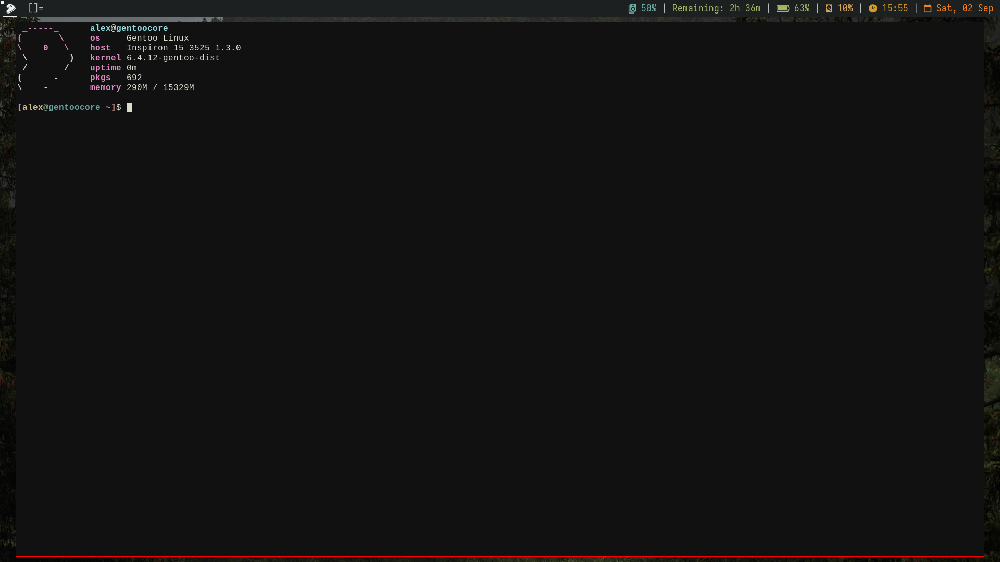

# MyDotfiles
Simple configurations I use on my daily driver

## What even is this?

Through this repository I used to provide multiple custom builds of suckless programs, such as st, dwm or dmenu (all of these can still be found in /git/legacy/), these were mostly based upon Luke Smith's builds, except for slstatus. I had made several additions and alterations to the source code to match my taste and criteria on program minimality and functionality. Nowadays, after my transition to wayland, this repo hosts many of my personal configurations I use on wayland, like dwl, dwlb with slstatus etc.

## Patches Applied

I applied the following patches to dwl:

- [autostart patch](https://github.com/djpohly/dwl/wiki/autostart), simple function to start apps after dwl is set up
- [keycodes patch](https://github.com/djpohly/dwl/wiki/keycodes), makes it so that input is independent from keyboard layout
- [keymapnotify patch](https://github.com/djpohly/dwl/wiki/keymapnotify), outputs current layout to /etc/dwl-keymap file, useful for showing your current layout on slstatus
- [monitorconfig patch](https://github.com/djpohly/dwl/wiki/monitorconfig), adds more extensive monitor configuration in config.h
- [XF86keysym patch](https://github.com/djpohly/dwl/wiki/XF86keysym), uses the /usr/include/X11/XF86keysym.h header file to change volume via the appropiate keys
- [xcursor patch](https://github.com/djpohly/dwl/wiki/xcursor), adds xcursor functionality, meaning that it hides the cursor after x seconds of inactivity
- [vanitygaps patch](https://github.com/djpohly/dwl/wiki/vanitygaps), adds gaps to windows

dwlb comes as it is with parts of the bloat cut out, I removed all pointless functionality and only left -status-stdin and -status, as well as the ability to set the foreground color for text through slstatus using ^fg(hex code without the #)text^fg(). bg coloring and middle mouse functionality can be added if you uncomment that part of dwlb.c

## Other Configurations

- bg, the bg folder has a few wallpapers that can be set through the scripts/setbg script
- cava, cava config that matches the nvim gruvbox theme
- ncmpcpp, music player configuration, mostly derived from lukesmith, just like mpd and newsboat
- nvim, contains both lua and vimscript version, has gruvbox colors as well as many other features
- zathura, the zathura configuration that works best for me
- zsh, zsh-plugins for fast-syntax-highlighting and autosuggestions with zsh

## Usage

Simply compile these programs and put the config files in the .config directory.

To run dwm, append 'exec dwm' to your .\*profile.

For dwl simply use the default .\*profile.

# 1. Legacy Xorg Configs
<detail>
## Patches Applied

I applied the following patches to dwm:

- statuspadding, determines the padding between the edge and the content of the statusbar
- barpadding, makes the statusbar float
- colorfultag patch (https://github.com/fitrh/dwm/issues/1 and siduck's chadwm), gives the tags some colour
- preserveonrestart patch, just so you can refresh dwm without all windows spawning on the first tag
- swallow patch, whenever you open a gui program from the terminal, it swallows it, meaning that the terminal disappears and the program appears, when you close the program, the terminal once again appears
- column patch, makes two windows the same size
- true fullscreen, alt-F makes the window as big as the whole screen
- shiftview, not really a patch but you can cycle through any tags in use by running with alt-; or alt-g
- vanity gaps, gaps and layouts, currently: tile, bstack, spiral, dwindle, deck, centeredmaster and centeredfloatingmaster
- notitle, windows have no title on the bar
- underline tags, tags in use have a little bar beneath them, looks good
- status2d, allows for a colored bar, the tags, as well as slstatus use it

And the following patches were removed:

- clickable statusbar
- xresources
- scratchpad
- stacker
- hide vacant tags
- sticky tags

st is luke smith's without the xresources patch, it comes with ligature support and the boxdraw patch

dmenu, which I don't currently use, is luke smith's build without the xresources patch

slstatus comes as it is and dwmblocks is purely luke smith's build with a new variable I defined so you don't have to flood your PATH with all these scripts

*All the patches previously mentioned can be added back or removed quite easily, and they all support colored emoji characters, you simply need to install an adequate font*

### Requirements

- imlib2 for nsxiv
- Xinerama for dwm
- any font patched that is patched with the nerd font symbols, only reason I use a nerd fonts is for the arch logo and the cooler retro cpu character, you can get away with font-awesome

## Other Configurations

- alacritty, Very simple config file, I just set the colors to match the rest of my setup and the font/font size
- my startup script with xinit
- all I care about from the /etc/default/grub like the kernel params, which make booting up a little quicker and much quieter
- some wallpapers I found while ricing at r/unixporn that just look amazing, perhaps not the best quality but you can search for the original images
- a couple dozen scripts, most come from lukesmith and other sources but I have written a few
- my config for firefox (simply Arkenfox with a user-override.js from [here](https://www.youtube.com/watch?v=GVOcElOPs8E))
- cava, with gruvbox colors
- slstatus, the suckless status monitor, looks stylish and doesn't have dwmblocks' delay, it is a bit of a pain to work with if you want to something complicated, but for something nice and simple it works very well.
- dunst, no other dunstrc worked as well so yeah, good enough, serves you notifications
- iptables, which is still under work and not even sure if I will use it
- lf, Luke Smith's config with lfimg scripts etc. ([cirala/lfimg](https://github.com/cirala/lfimg))
- mpd, uncomment and comment alsa or pulse, also has the visualizer
- mpv, simple enough, it doesn't lag and plays nicely + resumes any videos
- ncmpcpp, nothing crazy, just luke smith's with vim bindings
- newsboat
- nsxiv, control-x and then control-d deletes the current image, or well, moves it to ~/.local/trash/
- nvim, gruvbox colors, nice indenting, completion, lualine, web-devicons and colorizer. I wish to convert to init.lua but for now this config does everything I want it to
- picom, animations/blurred/transparent/rounded corners, dim-inactive, opacity-inactive and active. It looks nice and feels even better. you should use a picom fork that offers animations, like [picom-animations-git yay](https://aur.archlinux.org/packages/picom-animations-git)
- zathura, just a dark background and the basic bindings.
- zsh with zsh plugins, zshrc and zprofile

## Current Issues

## Usage

Simply compile these programs or put the config files in the .config directory.
I have tried compiling the suckless programs with the -03 flag but the resource usage was too high for the performance boost which was barely noticeable.
To run dwm simply use my .xinitrc script or append "exec dwm" to yours after compiling it.

## Possible Improvements

- [x] Make as many appplications transparent and/or blurry, including the terminal. Not sure how feasible this is with the simple terminal but it could improve this setup
- [x] Rounded corners on all windows, pretty sure this build has it if you disable the border px to 0 and run a compositor like picom
- [x] Give dwmblocks and the bar some color
- [x] init.vim to init.lua, *mostly done*. Only way I managed to do this is via NvChad or other distributions that come ready, but as you can see on /images/{lua.png,vimscript.png}, the difference is that of 5ms when booting into vim 100 times. Lua is a fun language to learn and perhaps useful in the future as more software is written with it or at least with it in mind, but for now I see no reason to switch over to init.lua. It is quite a pain to bridge the gap when you know nothing about lua and such a minimal performance gain on modern hardware is not worth days and days of my life, learning a bit of lua is surely worth it though

