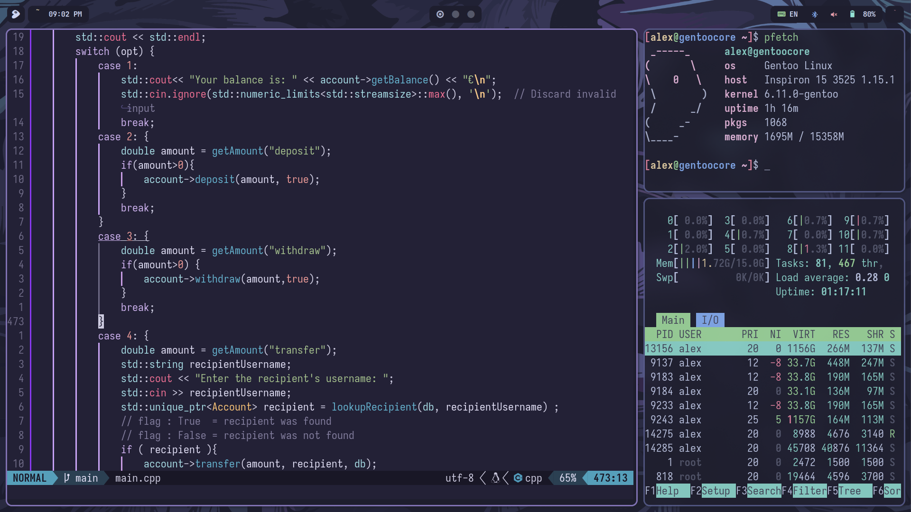

<h1 align="center">MyDotfiles - Hyprland Catppuccin</h1>
> Simple configurations I use on my daily driver

## What even is this?

This is the most recent version of the config files I use on my linux daily driver. It includes configurations for most programs I use, as well as the tiling window manager I'm using on this setup, hyprland. 

## Patches Applied

I applied the following patches to dwl:

dwlb comes as it is with parts of the bloat cut out, I removed all pointless functionality and only left -status-stdin and -status, as well as the ability to set the foreground color for text through slstatus using ^fg(hex code without the #)text^fg(). bg coloring and middle mouse functionality can be added if you uncomment that part of dwlb.c

## Other Configurations

- ncmpcpp, music player configuration, mostly derived from lukesmith, just like mpd and newsboat
- bg, the bg folder contains my background picture
- nvim, contains a standard version I use for text editing, and a superpowered nvim-code version which I use for programming.
- zathura, the zathura configuration that works best for me
- zsh, zsh-plugins for fast-syntax-highlighting and autosuggestions with zsh
- grub config
- kitty and fish config files, although I don't currently use them
- dunst config
- a few useful scripts I use, mostly derived from lukesmith
- lf file manager

## Usage

> Simply compile these programs and put the config files in the .config directory.
> Append the lines shown on the .zprofile file for hyprland and waybar to auto-start.
